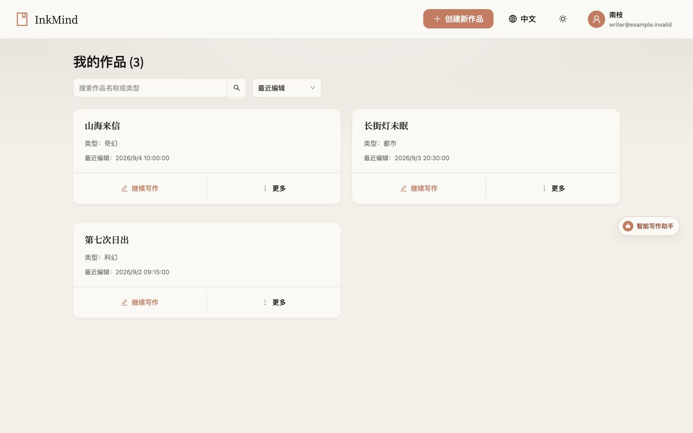
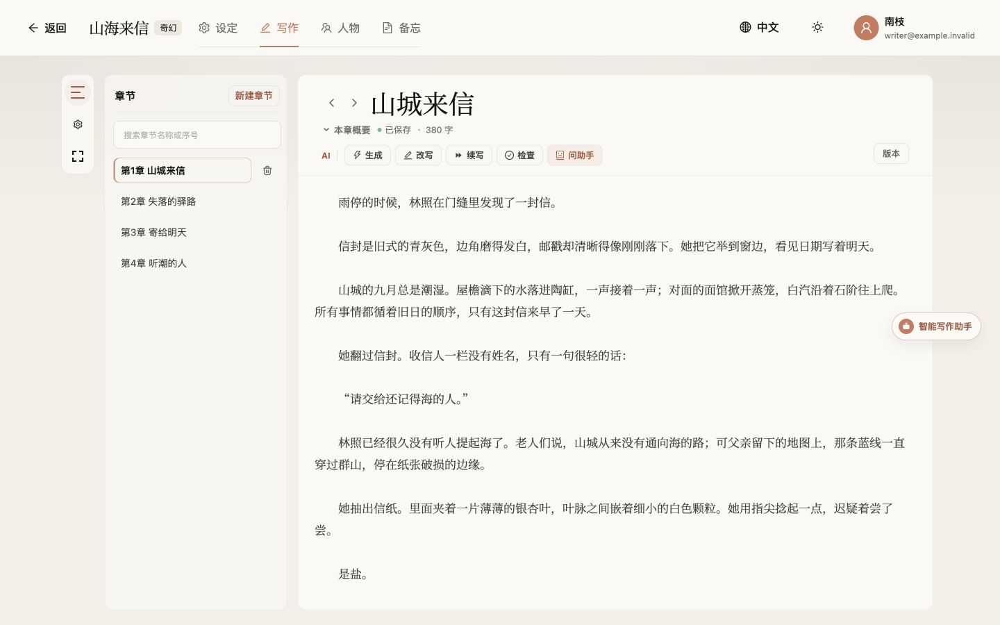
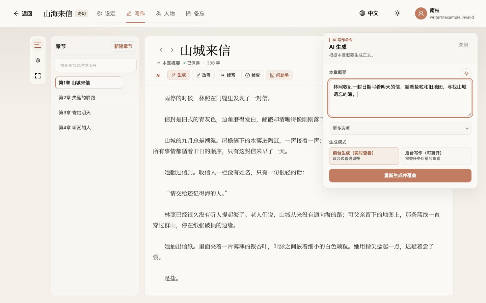
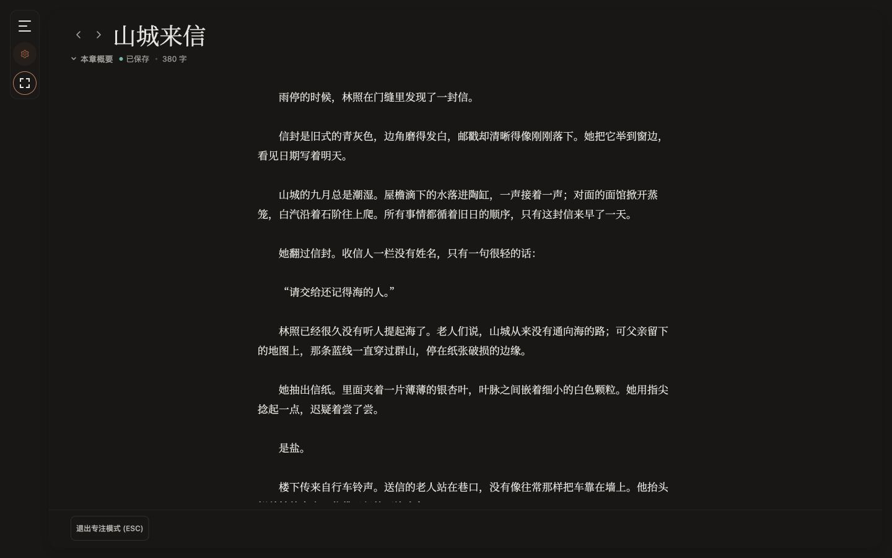
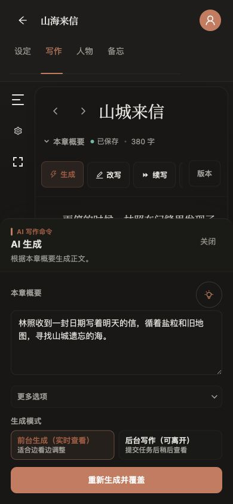
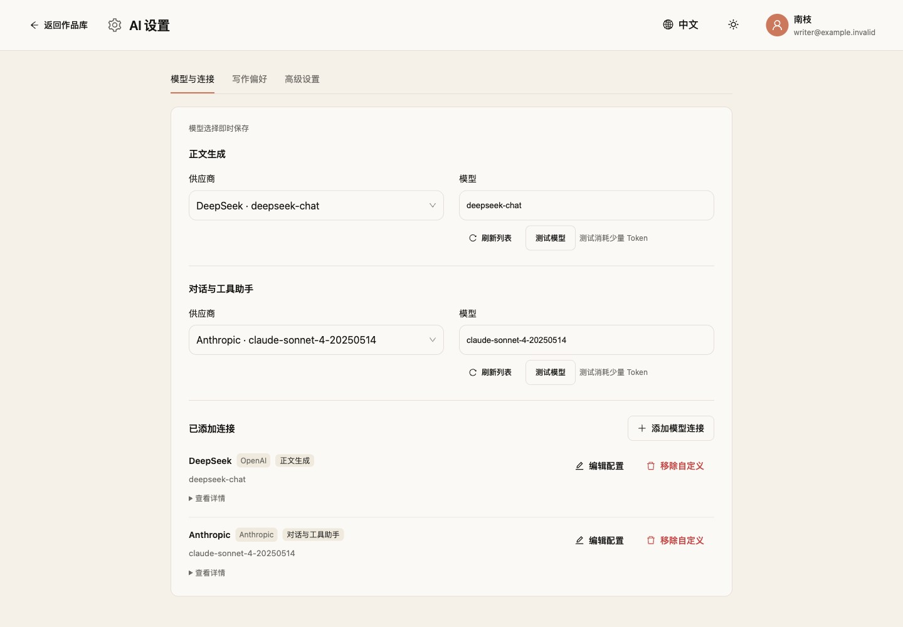
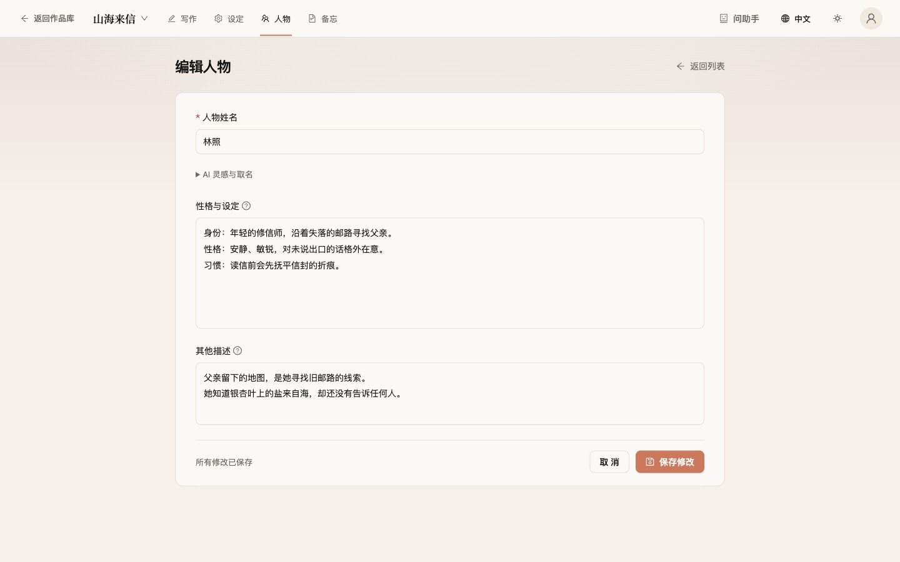
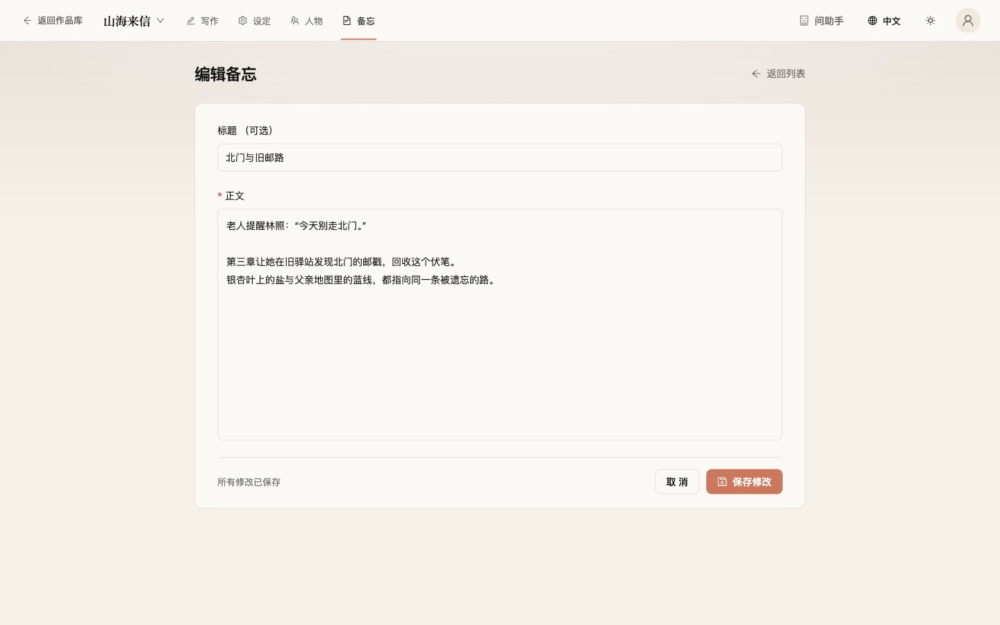
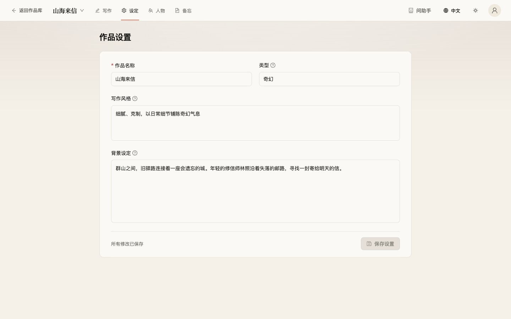
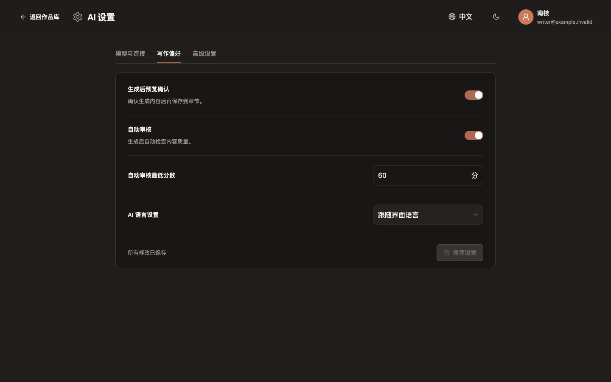

<div align="center">


# InkMind

[](https://www.python.org/)
[](https://nodejs.org/)
[](https://fastapi.tiangolo.com/)
[](https://react.dev/)
[](LICENSE)

**A low-distraction workspace for long-form fiction.** Keep your prose at the center, with novel settings, characters, memos, AI assistance, version history, and export close at hand.

[Features](#features) · [Preview](#preview) · [Desktop](#local-macos-desktop-app) · [Quick Start](#quick-start) · [Configuration](#configuration) · [Development Guide](#development-guide)

🌐 Language: [中文](README.md)

</div>

---

## Features

### Focused Writing

- **Novels and chapters**: search by title or genre, sort by recent edits, and return to where you left off.
- **A comfortable editor**: chapter search, adjustable typography, and light and dark themes. Focus mode hides navigation and AI tools; press `Esc` to return.
- **Autosave and version history**: track save status, recover local drafts, and review or restore earlier chapter versions. See [Saving and recovery](#saving-and-recovery).
- **Novel settings, characters, and memos**: organize writing style, story background, characters, and ideas in compact forms, with guidance and AI naming tools available when needed.
- **Export**: export completed chapters for backup, review, or publishing.

### AI Writing Assistance

Chat with the AI assistant about your novel using context from settings, chapters, characters, and memos. Ask it to continue a chapter or check for issues, follow its progress, and stop tasks when needed.

| Capability | Use |
| --- | --- |
| Chapter generation | Create summaries, titles, and prose using novel settings, characters, and previous chapters |
| Rewriting and continuation | Rewrite chapters to your instructions or continue from the end of the text |
| Selection expansion and polishing | Add detail, polish, or adjust selected paragraphs |
| Quality checks | Find chapter issues and suggest revisions, with optional automatic evaluation after generation |
| Generation preview | When enabled, review generated chapters before confirming and saving |

### Models and Usage

- Supports OpenAI, Anthropic, Qwen, DeepSeek, MiniMax, Kimi / Moonshot, and GLM.
- Choose separate connections and models for text generation and the assistant, with custom API keys, base URLs, and model IDs.
- Manage generation previews, automatic evaluation, and language under Writing preferences; adjust Agent modes and task limits under Advanced.
- Track calls, input/output tokens, quota usage, and model sources.
- Run supported writing tasks in the background and monitor progress. Web deployments also provide user, quota, and usage-log administration.

## Preview

Available in Chinese and English, with light and dark themes and layouts for desktop and mobile.

### Continue writing

Search and sort your novels, continue writing, or export and manage works from the More menu.



### A quieter editor

Chapter search, inline save status, and compact AI commands keep the prose in view.



<details>
<summary>AI tools and dark focus mode</summary>

Open AI tools from the editor to generate chapters using your novel’s context.



Hide navigation and AI controls in focus mode; adjust line width for comfortable reading.



</details>

<details>
<summary>Mobile layouts: light editor and dark AI panel</summary>

<table>
  <tr>
    <td align="center"><br/>Light editor</td>
    <td align="center"><br/>Dark AI panel</td>
  </tr>
</table>

</details>

### Novel references and AI settings

Compact forms keep novel references easy to edit. AI settings group connections, writing preferences, and advanced options, with connection details available on demand.



<details>
<summary>Characters, memos, and novel settings</summary>

Edit a character’s name, core profile, and additional notes together; AI inspiration and naming tools start collapsed.



Memos keep an optional title and a body for ideas and plot threads.



Manage the title, genre, writing style, and background in one form, with save status at the bottom.



</details>

<details>
<summary>Writing preferences in dark mode</summary>

Set preview confirmation, automatic evaluation, scores, and language; click Save Settings after making changes.



</details>

Screenshots use fictional demo data; model connections are illustrative. See [capture notes and reproduction steps](images/readme/README.md).

## Quick Start

### Local macOS Desktop App

**Download:** [Latest Release](https://github.com/jastfkjg/InkMind/releases/latest) · [Apple Silicon installer](https://github.com/jastfkjg/InkMind/releases/latest/download/InkMind-mac-arm64.dmg) · [Intel installer](https://github.com/jastfkjg/InkMind/releases/latest/download/InkMind-mac-x64.dmg). Fixed download links become available after the first Release is published; check its notes for signing status.

The desktop app requires no registration or login. Works are stored locally and do not sync with Web deployments. The installer includes the Python backend, so no additional runtime is needed.

Open **AI Settings → Models & connections**, click Add connection, and enter your credentials. Then choose separate models for text generation and the assistant. The assistant requires an Anthropic-compatible connection; see [in-app AI settings](#in-app-ai-settings). Desktop provides no built-in models and does not read model credentials from `.env`.

Prose, settings, characters, memos, versions, and usage records stay on this Mac. When using an online model, AI requests are sent to your selected provider.

For backup and troubleshooting, see the [desktop guide](docs/DESKTOP.en.md).

### Run from Source

- Python 3.12+
- Node.js 20+
- npm 9+

#### 1. Clone the Project

```bash
git clone https://github.com/jastfkjg/InkMind.git
cd InkMind
```

#### 2. Prepare the Backend

```bash
cd backend
python -m venv .venv
source .venv/bin/activate
pip install -r requirements.txt
cp env.example .env
```

Windows PowerShell:

```powershell
.\.venv\Scripts\Activate.ps1
```

Configure at least one usable model key in `backend/.env`, and make sure `DEFAULT_LLM_PROVIDER` points to it:

```env
DEFAULT_LLM_PROVIDER=qwen
QWEN_API_KEY=sk-...
QWEN_BASE_URL=https://dashscope.aliyuncs.com/compatible-mode/v1
QWEN_MODEL=qwen3-max
```

Start the backend:

```bash
uvicorn app.main:app --reload --host 0.0.0.0 --port 8000
```

Health check:

```bash
curl http://localhost:8000/health
```

#### 3. Prepare the Frontend

Open a new terminal at the repository root:

```bash
cd frontend
npm ci
npm run dev
```

Default URLs:

- Frontend: <http://localhost:5173>
- Backend: <http://localhost:8000>
- API docs: <http://localhost:8000/docs>

The Vite development server proxies `/api/*` to the backend and strips the `/api` prefix.

#### 4. One-command Development Startup

After installing dependencies, activate the backend virtual environment and run from the repository root:

```bash
source backend/.venv/bin/activate
./start-dev.sh
```

Custom ports:

```bash
VITE_FRONTEND_PORT=5174 VITE_BACKEND_PORT=8001 ./start-dev.sh
```

## Configuration

### In-app AI settings

1. **Models & connections**: click Add connection, enter the provider, API protocol, key, service URL, and default model, then assign its purpose. You can refresh the model list or test a model; testing consumes a small number of tokens.
2. **Choose models separately**: text generation and the assistant have independent selections. The assistant requires the Anthropic-compatible protocol. Provider and preset-model changes save immediately; after typing a model ID, press `Enter` or click Save beside the model field.
3. **Writing preferences and Advanced**: after adjusting previews, automatic evaluation, language, Agent mode, or task limits, click Save Settings. Switching categories preserves edits. When leaving, you can save or discard changes; failed saves can be retried.

### Web environment variables

The repository includes two environment templates:

- `.env.example`: project-level development configuration, including frontend/backend ports, JWT, model, Agent, and observability settings.
- `backend/env.example`: backend runtime template; copy it to `backend/.env`.

Common settings:

| Variable | Default | Description |
| --- | --- | --- |
| `DATABASE_URL` | `sqlite:///./inkmind.db` | Database URL; defaults to SQLite under the backend directory |
| `SECRET_KEY` | `change-me...` | JWT signing secret; replace it in production |
| `CORS_ORIGINS` | `http://localhost:5173,http://127.0.0.1:5173` | Allowed frontend origins |
| `DEFAULT_LLM_PROVIDER` | `qwen` | Default model provider |
| `OPENAI_API_KEY` | empty | OpenAI or compatible gateway key |
| `QWEN_API_KEY` | empty | Qwen DashScope key |
| `DEEPSEEK_API_KEY` | empty | DeepSeek key |
| `MINIMAX_API_KEY` | empty | MiniMax key |
| `MOONSHOT_API_KEY` / `KIMI_API_KEY` | empty | Kimi / Moonshot key |
| `ANTHROPIC_API_KEY` | empty | Anthropic key, also usable for Claude Agent SDK |
| `GLM_API_KEY` | empty | Zhipu GLM key |
| `AGENT_MAX_TURNS` | `30` | Maximum Agent reasoning turns |
| `AGENT_PERMISSION_MODE` | `bypassPermissions` | AI Assistant Agent permission mode |
| `CLAUDE_CLI_PATH` | empty | Claude Code CLI path; auto-detected by default |
| `PROMETHEUS_ENABLED` | `false` | Enable Prometheus metrics server |
| `OTEL_ENABLED` | `false` | Enable OpenTelemetry |

> Do not commit real API keys, production accounts, database files, or local `.env` files.

## Docker Deployment

See [cloud deployment guide](docs/DEPLOYMENT.md) for manual releases and migration. Pushing main does not deploy production.

Copy the project-level configuration:

```bash
cp .env.example .env
```

Edit `.env`, set at least `SECRET_KEY` and one model provider key, then start the stack:

```bash
docker compose up -d --build
```

Default services:

- Frontend Nginx: <http://localhost>
- Backend container port: `8000`
- SQLite data volume: `inkmind-data`

View logs:

```bash
docker compose logs -f backend
docker compose logs -f frontend
```

Stop services:

```bash
docker compose down
```

## Tech Stack

| Layer | Technology |
| --- | --- |
| Backend | Python 3.12+ · FastAPI · Uvicorn · SQLAlchemy 2.0 · Pydantic 2 |
| Frontend | React 18 · TypeScript · Vite 6 · React Router 7 · Ant Design 6 · Axios |
| Database | SQLite (default) |
| Authentication | JWT · passlib/bcrypt |
| AI Integration | OpenAI SDK · Anthropic SDK · OpenAI-compatible APIs |
| Observability | OpenTelemetry · Prometheus metrics |
| Desktop | Electron · electron-builder · PyInstaller |
| Web deployment | Docker · Docker Compose · Nginx |

## Development Guide

Test and build the frontend:

```bash
cd frontend
npm ci
npm test
npm run build
```

Start desktop development from the repository root:

```bash
./start-desktop.sh
```

Build macOS installers:

```bash
cd desktop
npm install
npm run package:mac
```

| Directory | Contents |
| --- | --- |
| `backend/app/` | APIs, data models, AI integrations, and writing services |
| `frontend/src/` | Pages, components, themes, and translations |
| `desktop/` | Electron app and packaging scripts |
| `docs/` | Desktop architecture, backup, and deployment documentation |

See [DESIGN.md](DESIGN.md) for visual guidelines and the [desktop guide](docs/DESKTOP.en.md) for packaging and releases.

## FAQ

### Saving and recovery

- Ordinary chapter edits are saved automatically. If saving fails, stay on the page and use Retry; in-app navigation and logout are blocked until pending prose saves.
- Novel settings, characters, memos, and AI writing preferences use their Save buttons, with a prompt for unsaved changes when leaving. AI provider and preset-model selections save immediately.
- Unsynced text is also kept in browser-local storage when available. Reopening offers Restore or Keep server version, rather than silently overwriting either version.
- Local drafts and reading position belong to this browser and account. They are not cross-device sync or a backup guarantee: private browsing, cleared storage, or storage limits can prevent recovery. Export important work regularly.
- AI streaming and unconfirmed generation previews are not treated as ordinary edits by autosave. Review and confirm or cancel the preview before continuing to edit.
- Closing the browser is not the same as an in-app navigation: wait for Saved before closing, especially during network problems.

### Frontend API calls return 404 or login does not work

Make sure the backend is running at `VITE_BACKEND_HOST:VITE_BACKEND_PORT`, which defaults to `127.0.0.1:8000`. In development, the frontend calls `/api/*`, and Vite proxies those requests to the backend.

The desktop app does not show a login page. If it cannot enter the novel library, quit InkMind completely and inspect `~/Library/Application Support/inkmind-desktop/logs/backend.log`. Do not start the backend executable inside the installed app manually.

### AI features say no model is configured

Under **AI Settings → Models & connections**, check both model selections and make sure the protocol, URL, and credentials match. Desktop requires your own connections. Web users can also check that the API key in `backend/.env` matches `DEFAULT_LLM_PROVIDER`. See [in-app AI settings](#in-app-ai-settings) for setup steps.

### CORS errors

Add the current frontend URL to backend `CORS_ORIGINS`, for example:

```env
CORS_ORIGINS=http://localhost:5173,http://127.0.0.1:5173,http://localhost:5174
```

## License

This project is open source under [GNU General Public License v3.0](LICENSE).
