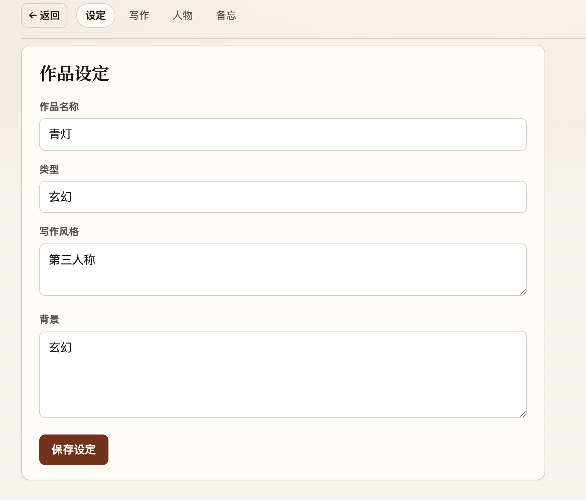
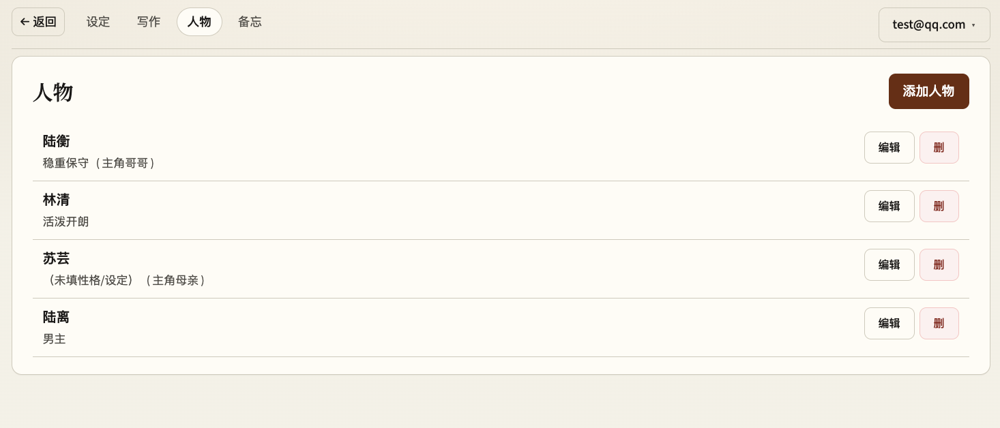
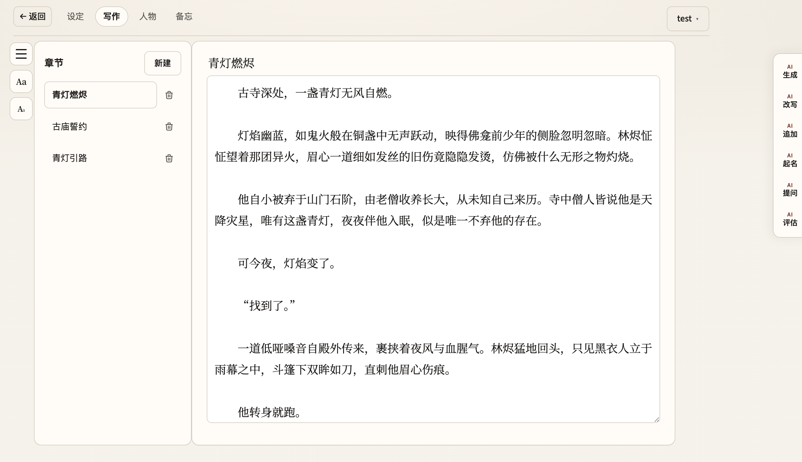
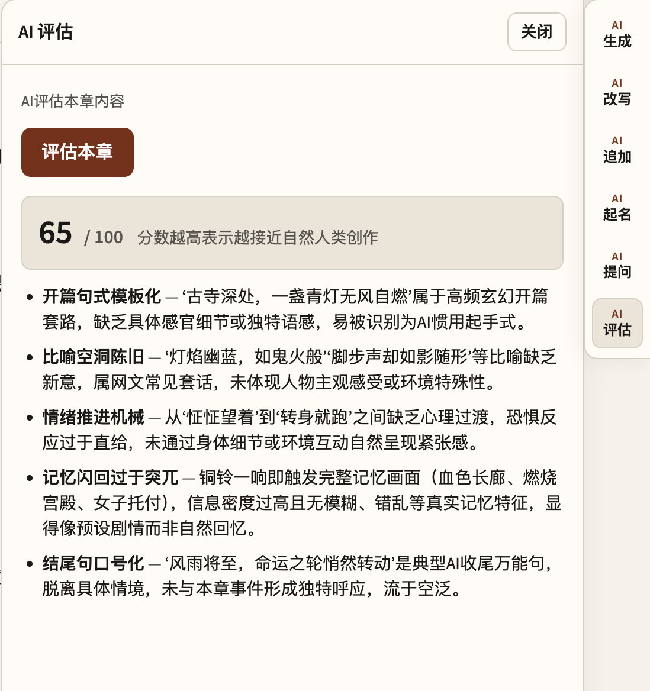
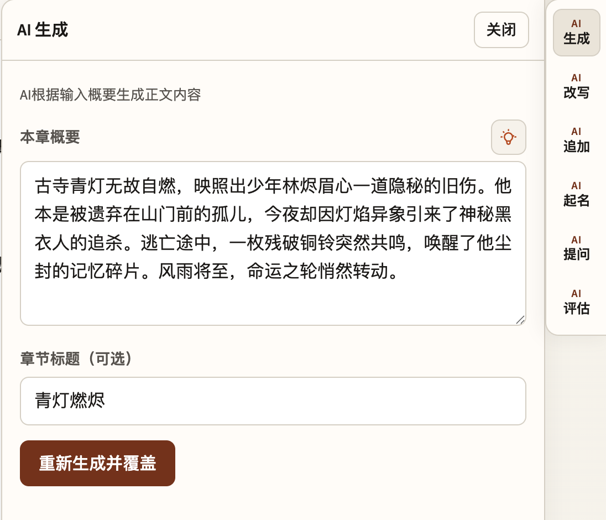
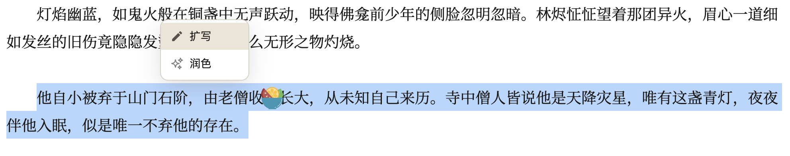
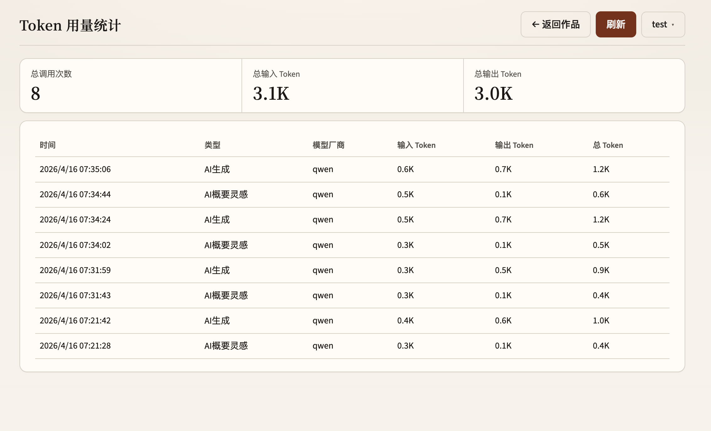
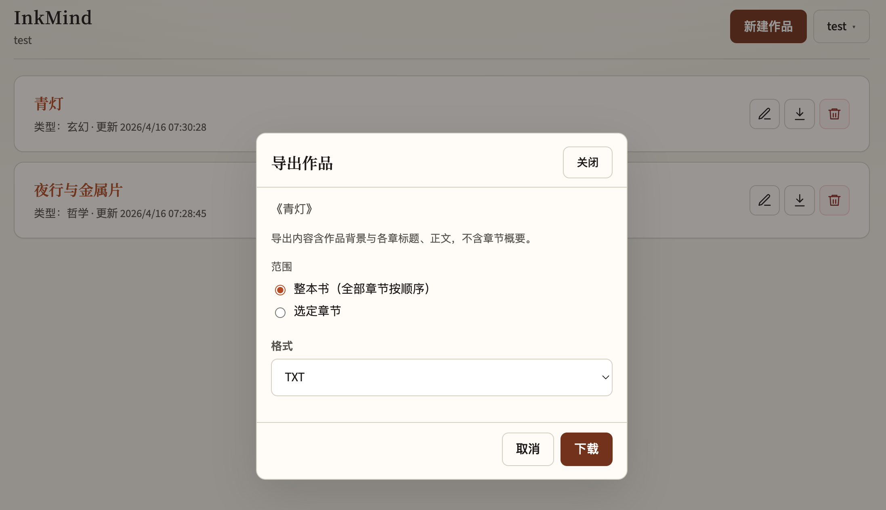

# InkMind

<div align="center">

[](https://www.python.org/)
[](https://nodejs.org/)
[](LICENSE)
[](https://fastapi.tiangolo.com/)
[](https://react.dev/)

**AI 辅助小说写作工具** — 作品管理、章节编辑、人物设定、多模型 AI 生成、导出发布，一站式解决方案。

[功能介绍](#功能概览) · [快速上手](#快速上手) · [部署指南](#部署) · [项目结构](#项目结构) · [获取帮助](#获取帮助)

</div>

---

## 功能概览

### 写作工具箱

| 功能 | 说明 |
|------|------|
| **AI 生成** | 根据作品设定及前文自动生成本章概要、标题与正文 |
| **AI 改写** | 按要求改写当前章节内容 |
| **AI 追加** | 在当前正文末尾追加新内容 |
| **AI 提问** | 通用问题解答，随时调用 |
| **AI 评估** | 分析章节不足，给出改进建议 |
| **AI 扩写 / 润色** | 选中段落，单独扩写或润色 |

### 核心功能

- **多 LLM 支持** — OpenAI / Anthropic / 通义千问 / DeepSeek / MiniMax / Kimi，一键切换
- **作品管理** — 大纲、类型（文学/玄幻/都市/爱情/哲学等）、写作风格、背景设定
- **章节编辑** — 增删改排序、正文在页编辑、字体调整
- **人物系统** — 人物卡管理，含角色关系（生成时自动纳入上下文）
- **作品导出** — 支持多种格式导出已完成的章节
- **Token 统计** — 各模型用量、调用次数、费用一目了然

## 预览

### 作品列表


### 作品设定


作品信息、类型、写作风格与背景设定。

### 人物管理


人物卡支持姓名、昵称、简介、角色关系，生成章节时自动带入上下文。

### 章节写作


右侧 AI 工具栏提供：生成、改写、追加、提问、评估五大功能。

### AI 评估


AI 评估当前章节存在的问题与不足，给出具体改进建议。

### AI 生成


### 选中扩写 & 润色


选中章节中的任意段落，一键扩写或润色。

### Token 用量统计


各模型本月调用次数与消耗金额实时统计。

### 作品导出


---

## 快速上手

### 环境要求

- **Python** 3.10+
- **Node.js** 18+

### 1. 克隆项目

```bash
git clone https://github.com/yourname/InkMind.git
cd InkMind
```

### 2. 启动后端

```bash
cd backend
python -m venv .venv
source .venv/bin/activate          # Windows: .venv\Scripts\activate
pip install -r requirements.txt
cp env.example .env                # 复制环境变量模板
```

在 `backend/.env` 中设置模型API key：

```env
# AI 模型 Key（按需填写）
QWEN_API_KEY=sk-xxxxxxxx
# DEEPSEEK_API_KEY=sk-xxxxxxxx
# MINIMAX_API_KEY=sk-xxxxxxxx
# 其他模型同理
```

启动服务：

```bash
uvicorn app.main:app --reload --host 0.0.0.0 --port 8000
```

### 3. 启动前端

```bash
cd frontend
npm install
npm run dev
```

浏览器打开 <http://localhost:5173>，开始创作。

---

## 项目结构

```
InkMind/
├── backend/
│   ├── app/
│   │   ├── main.py          # FastAPI 入口，lifespan、路由注册
│   │   ├── config.py        # Pydantic Settings 配置
│   │   ├── database.py      # SQLAlchemy 引擎与会话
│   │   ├── models.py        # ORM 模型定义
│   │   ├── routers/         # API 路由（auth, novels, chapters, characters, memos, meta, usage）
│   │   ├── schemas/         # Pydantic 请求/响应模型
│   │   ├── services/        # 业务逻辑层
│   │   ├── llm/             # 多模型 LLM 集成
│   │   └── observability/   # OpenTelemetry 配置
│   ├── scripts/
│   ├── requirements.txt
│   └── env.example
│
├── frontend/
│   ├── src/
│   │   ├── api/             # Axios API 客户端
│   │   ├── components/      # React 组件
│   │   ├── pages/           # 页面组件
│   │   ├── types/           # TypeScript 类型定义
│   │   └── App.tsx
│   ├── vite.config.ts       # Vite 配置（含开发代理）
│   ├── package.json
│   └── dist/                # 生产构建产物
│
├── images/                   # README 截图
├── LICENSE
└── README.md
```

---

## 技术栈

| 层级 | 技术 |
|------|------|
| 后端 | FastAPI · Uvicorn · SQLAlchemy 2.0 · Pydantic 2.10 |
| 前端 | React 18 · Vite 6 · TypeScript 5.7 · React Router 7 · Axios |
| 数据库 | SQLite（默认）· PostgreSQL（生产推荐） |
| 认证 | JWT (python-jose) · bcrypt |
| AI | OpenAI · Anthropic · 通义千问 · DeepSeek · MiniMax · Kimi |
| 可观测性 | OpenTelemetry（支持 OTLP 导出） |

---

## 获取帮助

- 🐛 遇到问题请提交 [Issue](https://github.com/yourname/InkMind/issues)
- 💡 欢迎提交 Pull Request

---

## 许可证

本项目基于 [GNU General Public License v3.0](LICENSE) 开源。
