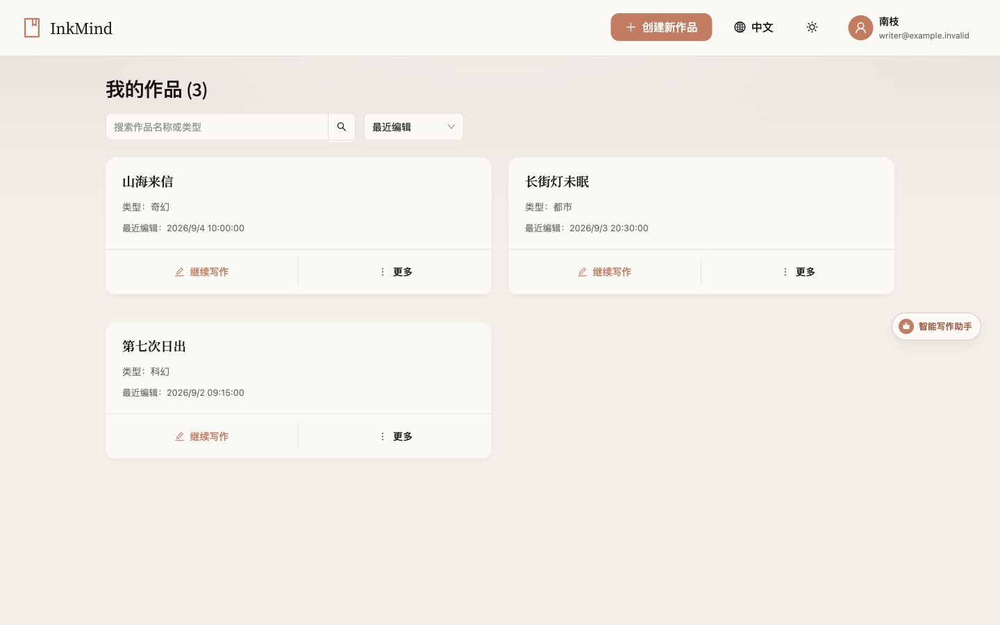
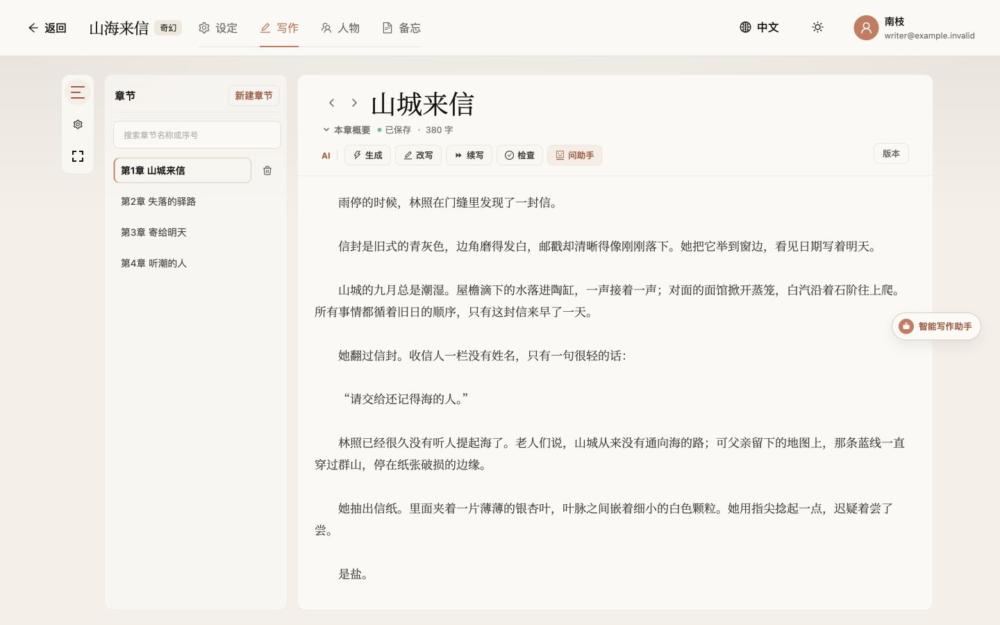
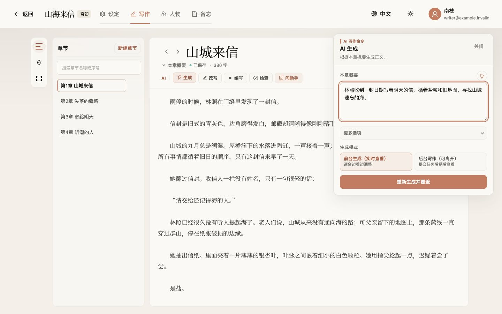
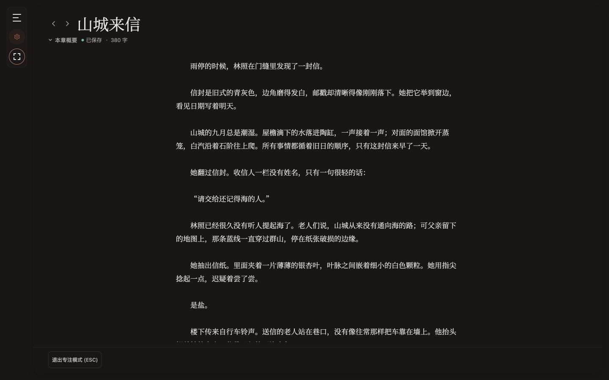
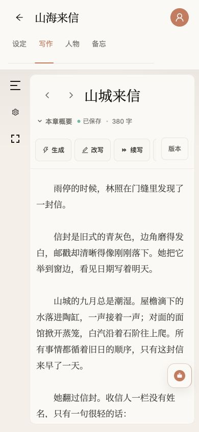
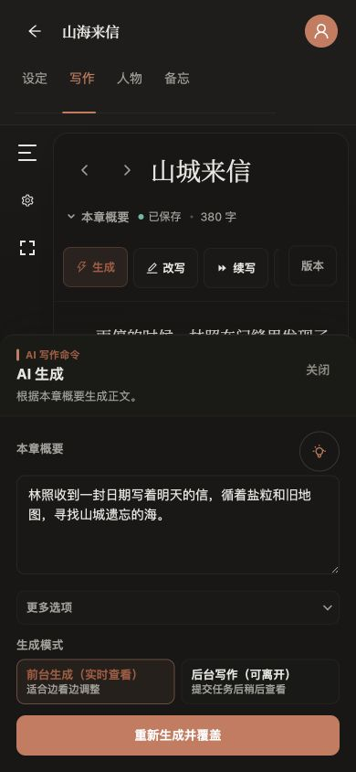

<div align="center">


# InkMind

[](https://www.python.org/)
[](https://nodejs.org/)
[](https://fastapi.tiangolo.com/)
[](https://react.dev/)
[](LICENSE)

**为长篇创作而生的低干扰写作工作台。** 以正文为中心，将作品设定、人物、备忘录、AI 辅助、历史版本和导出放在触手可及的位置。

[功能概览](#功能概览) · [界面预览](#界面预览) · [桌面版](#macos-本地桌面版) · [快速开始](#快速开始) · [配置说明](#配置说明) · [开发指南](#开发指南)

🌐 Language: [English](README.en.md)

</div>

---

## 功能概览

InkMind 面向长篇小说、网文和剧情型内容创作，核心目标是把“设定、正文、AI 辅助和版本确认”放在一个低干扰的写作流里。

### 以写作为中心的工作流

1. **随时继续创作**：按标题或类型搜索作品，按最近编辑排序，一键继续写作。
2. **把空间留给正文**：搜索章节、调整字号与行距；进入专注模式后隐藏全局导航与 AI 工具，按 `Esc` 返回。
3. **清楚知道保存状态**：自动保存展示待保存、保存中、已保存和失败重试状态；站内跳转与退出登录会先等待待保存内容提交。
4. **需要时再请 AI 帮忙**：在编辑器内展开生成、改写、续写、检查或助手；工具面板与助手互相收起，减少遮挡。

浏览器会按账号和作品记住上次章节、光标选区和滚动位置；未同步草稿再次打开时会提示选择是否恢复。具体边界见[保存与恢复](#保存与恢复)。

### AI 助手

AI 助手是 InkMind 的主要智能写作入口。它以悬浮面板的形式出现在作品列表和写作工作区，可以围绕当前作品进行连续对话，并主动读取作品设定、章节、人物和备忘录上下文。

- **上下文感知**：自动读取作品状态、章节详情、人物设定和创作备忘录，减少重复描述背景。
- **自然语言驱动**：可以直接输入“写一章”“续写当前章节”“检查这章问题”“保存为正式章节”等写作指令。
- **可追踪执行过程**：生成过程中展示读取上下文、生成摘要、生成正文、质量检查、保存章节等阶段。
- **人机协作确认**：遇到需要选择或补充信息时，助手会向用户提问；生成内容也可先编辑再应用。
- **任务可中断**：长任务执行中可以停止当前任务，避免错误方向继续消耗额度。
- **章节落库**：助手生成并确认后的章节可以直接保存到当前作品章节列表。

### 写作与创作

- **作品管理**：维护作品标题、类型、写作风格和背景设定。
- **章节写作**：章节增删、搜索、正文编辑、历史版本查看与回滚。
- **人物系统**：维护角色姓名、人物简介和备注，在简介中记录外观、关系与剧情作用。
- **备忘录系统**：记录世界观、伏笔、灵感、设定补充和待处理事项。
- **作品导出**：将已完成章节导出为文件，便于备份、审阅或发布。

### AI 辅助

| 能力 | 说明 |
| --- | --- |
| AI 助手 | 悬浮式智能写作面板，支持连续对话、读取作品上下文、编排写作任务并保存章节 |
| AI 生成 | 结合作品设定、人物和前文生成章节概要、标题与正文 |
| AI 改写 | 按自定义要求重写当前章节内容 |
| AI 续写 | 在正文末尾续写新内容 |
| AI 检查 | 分析章节问题，输出质量建议和可执行修改方向 |
| 选区扩写/润色 | 对选中的段落单独扩写、润色或调整表达 |
| 预览确认 | 开启生成预览后，先审阅生成的章节再确认保存；并非所有 AI 操作都经过同一确认流程 |
| 自动审核 | 生成后自动做质量评估和问题检测 |

### 模型与管理

- **多模型支持**：OpenAI、Anthropic、通义千问、DeepSeek、MiniMax、Kimi / Moonshot、GLM。
- **多 Agent 模式**：Flexible Agent、ReAct、直接 LLM 调用，可按用户偏好切换。
- **自定义模型配置**：支持内置提供商，也支持用户级自定义 API Key、Base URL 和模型名。
- **Token 用量统计**：记录调用次数、输入/输出 Token、额度消耗和模型来源。
- **后台任务**：支持将写作操作提交为后台任务，并在任务页查看状态。
- **管理后台**：管理员可查看用户、额度和调用日志。

## 界面预览

以下图片来自当前前端，使用虚构作品与隔离的内存演示数据；不展示真实账户、小说正文、API Key 或生产用量。截图为中文界面，应用同时支持英文。

### 从作品列表继续写作

搜索、排序与继续写作更直接；导出和删除仍保留在“更多”菜单。



### 更安静的章节编辑器

章节搜索、行内保存状态与紧凑的 AI 命令，让正文保持在视线中心。



<details>
<summary>展开查看：AI 工具与深色专注模式</summary>

需要时才展开 AI 命令。这里展示生成表单，不代表真实模型生成结果。



专注模式隐藏导航与 AI 工具，可调节行宽，保持舒适阅读。



</details>

<details>
<summary>展开查看：手机浅色编辑器与深色 AI 面板</summary>

<table>
  <tr>
    <td align="center"><br/>浅色编辑器</td>
    <td align="center"><br/>深色 AI 面板</td>
  </tr>
</table>

</details>

截图尺寸：桌面 1440 × 900，手机 390 × 844。[截图复现说明](images/readme/README.md)。

## 技术栈

| 层级 | 技术 |
| --- | --- |
| 后端 | Python 3.12+ · FastAPI · Uvicorn · SQLAlchemy 2.0 · Pydantic 2 |
| 前端 | React 18 · TypeScript · Vite 6 · React Router 7 · Ant Design 6 · Axios |
| 数据库 | SQLite（默认） |
| 认证 | JWT · passlib/bcrypt |
| AI 接入 | OpenAI SDK · Anthropic SDK · OpenAI 兼容接口 |
| 可观测性 | OpenTelemetry · Prometheus 指标 |
| 桌面端 | Electron · electron-builder · PyInstaller |
| Web 部署 | Docker · Docker Compose · Nginx |

## 快速开始

### macOS 本地桌面版

桌面版会启动仅监听本机回环地址的 FastAPI 服务，并把数据库保存在 macOS 应用数据目录。它使用单一本地作者身份，不需要注册或登录，也不会与 Web 版同步作品。正文、设定、人物、备忘录、版本和用量记录只写入这台 Mac；配置在线模型后，AI 请求仍会发送到所选模型服务。

首次启动开发版会安装桌面和 Python 依赖：

```bash
./start-desktop.sh
```

生成可安装的 DMG 和 ZIP：

```bash
cd desktop
npm install
npm run package:mac
```

安装产物写入 `desktop/release/`。Python 后端由 PyInstaller 一并打包，使用者不需要另行安装 Python。当前脚本构建运行机器对应的 CPU 架构；正式发布给其他用户前还需要配置 Developer ID 签名与 Apple 公证。

桌面架构、数据路径、备份方式、发布检查和故障排查见[桌面版开发与发布指南](docs/DESKTOP.md)。

### 环境要求

- Python 3.12+
- Node.js 20+（本地开发）；Docker 构建前端镜像时使用 Node 20
- npm 9+

### 1. 克隆项目

```bash
git clone https://github.com/jastfkjg/InkMind.git
cd InkMind
```

### 2. 准备后端环境

```bash
cd backend
python -m venv .venv
source .venv/bin/activate
pip install -r requirements.txt
cp env.example .env
```

Windows PowerShell 激活方式：

```powershell
.\.venv\Scripts\Activate.ps1
```

至少需要在 `backend/.env` 中配置一个可用模型 Key，并确保 `DEFAULT_LLM_PROVIDER` 指向它：

```env
DEFAULT_LLM_PROVIDER=qwen
QWEN_API_KEY=sk-...
QWEN_BASE_URL=https://dashscope.aliyuncs.com/compatible-mode/v1
QWEN_MODEL=qwen3-max
```

启动后端：

```bash
uvicorn app.main:app --reload --host 0.0.0.0 --port 8000
```

健康检查：

```bash
curl http://localhost:8000/health
```

### 3. 准备前端环境

新开一个终端：

```bash
cd frontend
npm ci
npm run dev
```

默认访问地址：

- 前端：<http://localhost:5173>
- 后端：<http://localhost:8000>
- API 文档：<http://localhost:8000/docs>

前端开发服务器会把 `/api/*` 代理到后端，并去掉 `/api` 前缀。

### 4. 一键启动开发环境

项目也提供了开发启动脚本。使用前请先完成后端虚拟环境和前端依赖安装：

```bash
./start-dev.sh
```

自定义端口：

```bash
VITE_FRONTEND_PORT=5174 VITE_BACKEND_PORT=8001 ./start-dev.sh
```

## 配置说明

仓库内有两份环境变量模板：

- `.env.example`：项目级开发配置，包含前端端口、后端端口、JWT、模型、Agent、观测配置。
- `backend/env.example`：后端运行所需配置模板，复制到 `backend/.env` 后生效。

常用配置：

| 变量 | 默认值 | 说明 |
| --- | --- | --- |
| `DATABASE_URL` | `sqlite:///./inkmind.db` | 数据库连接，默认使用后端目录下的 SQLite |
| `SECRET_KEY` | `change-me...` | JWT 签名密钥，生产环境必须替换 |
| `CORS_ORIGINS` | `http://localhost:5173,http://127.0.0.1:5173` | 允许访问后端的前端来源 |
| `DEFAULT_LLM_PROVIDER` | `qwen` | 默认模型提供商 |
| `OPENAI_API_KEY` | 空 | OpenAI 或兼容网关 Key |
| `QWEN_API_KEY` | 空 | 通义千问 DashScope Key |
| `DEEPSEEK_API_KEY` | 空 | DeepSeek Key |
| `MINIMAX_API_KEY` | 空 | MiniMax Key |
| `MOONSHOT_API_KEY` / `KIMI_API_KEY` | 空 | Kimi / Moonshot Key |
| `ANTHROPIC_API_KEY` | 空 | Anthropic Key，也可用于 Claude Agent SDK |
| `GLM_API_KEY` | 空 | 智谱 GLM Key |
| `AGENT_MAX_TURNS` | `30` | Agent 最大推理轮数 |
| `AGENT_PERMISSION_MODE` | `bypassPermissions` | AI 助手 Agent 权限模式 |
| `CLAUDE_CLI_PATH` | 空 | Claude Code CLI 路径，默认自动检测 |
| `PROMETHEUS_ENABLED` | `false` | 是否启用 Prometheus 指标服务 |
| `OTEL_ENABLED` | `false` | 是否启用 OpenTelemetry |

> 不要提交真实 API Key、生产账号、数据库文件或本地 `.env`。

## Docker 部署

复制项目级配置：

```bash
cp .env.example .env
```

编辑 `.env`，至少设置 `SECRET_KEY` 和一个模型提供商 Key，然后启动：

```bash
docker compose up -d --build
```

默认服务：

- 前端 Nginx：<http://localhost>
- 后端容器内端口：`8000`
- SQLite 数据卷：`inkmind-data`

查看日志：

```bash
docker compose logs -f backend
docker compose logs -f frontend
```

停止服务：

```bash
docker compose down
```

## 开发指南

### 构建与回归检查

在 `frontend/` 下运行：

```bash
npm ci
npm test
npm run build
```

单元测试覆盖草稿存储、账号/作品隔离、并发保存合并与失败重试。[浏览器回归指南](frontend/tests/README.md)提供隔离演示服务，以及导航、AI 预览、版本恢复与响应式检查清单；这些检查不能替代真实后端和模型集成测试。

不配置数据库或 API Key 也能预览界面：以 `node tests/ui-fixture.mjs --demo` 启动演示服务，再按指南的独立 Vite 命令运行前端。这是本地 UI 示例，不是完整离线应用。

### 主要路由

前端：

| 路径 | 页面 |
| --- | --- |
| `/` | 作品列表 |
| `/login` / `/register` | 登录与注册 |
| `/settings` | AI 设置 |
| `/usage` | Token 用量 |
| `/tasks` | 后台任务 |
| `/novels/:novelId/write` | 章节写作 |
| `/novels/:novelId/settings` | 作品设定 |
| `/novels/:novelId/people` | 人物管理 |
| `/novels/:novelId/memos` | 备忘录 |
| 作品内全局悬浮面板 | AI 助手，支持当前作品上下文写作与任务编排 |
| `/admin/users` | 用户管理 |
| `/admin/logs` | 调用日志 |

后端路由前缀：

| 前缀 | 说明 |
| --- | --- |
| `/auth` | 注册、登录、当前用户 |
| `/novels` | 作品管理 |
| `/chapters` | 章节管理 |
| `/characters` | 人物管理 |
| `/memos` | 备忘录 |
| `/usage` | Token 用量 |
| `/background-tasks` | 后台任务 |
| `/workflow` | 写作工作流 |
| `/novels/{novel_id}/agent` | AI 助手会话、SSE 对话、用户确认、任务中断与结果应用 |
| `/custom-llms` | 用户自定义模型 |
| `/admin` | 管理后台 |
| `/meta` | 元信息 |

### 目录结构

```text
InkMind/
├── backend/
│   ├── app/
│   │   ├── main.py              # FastAPI 入口、CORS、路由注册、SQLite 自动迁移
│   │   ├── config.py            # Pydantic Settings 配置
│   │   ├── database.py          # SQLAlchemy 引擎与会话
│   │   ├── models.py            # ORM 模型
│   │   ├── routers/             # API 路由
│   │   ├── schemas/             # 请求/响应模型
│   │   ├── services/            # 章节生成、评估、版本、导出、任务逻辑
│   │   ├── llm/                 # 多模型接入、流式输出、Token 统计
│   │   ├── agent/               # AI 助手编排、工具调用、任务队列
│   │   ├── workflow/            # 写作工作流引擎
│   │   └── observability/       # OpenTelemetry 与指标
│   ├── scripts/                 # 辅助脚本
│   ├── requirements.txt
│   └── env.example
├── frontend/
│   ├── src/
│   │   ├── api/                 # Axios 客户端
│   │   ├── components/          # 通用组件、写作页组件与 AI 助手面板
│   │   ├── context/             # 认证、主题、导航上下文
│   │   ├── i18n/                # 中英文文案
│   │   ├── pages/               # 页面组件
│   │   ├── styles/              # 主题、基础样式、页面样式
│   │   ├── types/               # TypeScript 类型
│   │   └── App.tsx              # 路由入口
│   ├── tests/                   # 保存回归测试与本地 UI 演示服务
│   ├── package.json
│   └── vite.config.ts
├── desktop/                     # Electron 主进程、preload 与 macOS 打包配置
│   ├── main.ts                  # 本地后端生命周期、窗口和会话桥接
│   ├── preload.ts               # 受限桌面 API
│   └── scripts/                 # PyInstaller 后端构建脚本
├── docs/
│   ├── DESKTOP.md               # 桌面架构、数据与发布指南
│   └── DESKTOP.en.md            # 英文桌面指南
├── images/                      # README 截图
├── docker-compose.yml
├── start-desktop.sh             # 桌面开发环境入口
├── start-dev.sh
├── DESIGN.md                    # 视觉系统与 UI 规范
├── AGENTS.md                    # 协作与工程约定
├── README.en.md
└── README.md
```

### 国际化与主题

- 前端文案集中在 `frontend/src/i18n/`。
- 新增可见中文/英文文案时，应补齐翻译 key。
- 主题和视觉变量集中在 `frontend/src/styles/`，视觉规范以 `DESIGN.md` 为准。
- UI 修改需要检查浅色、深色、桌面宽屏和移动端。

## 常见问题

### 保存与恢复

- 普通编辑会自动保存。失败时请留在当前页并点击重试；有未保存修改时，站内导航与退出登录会先等待保存成功。
- 浏览器存储可用时，未同步正文也会保留为本地草稿；重新打开后可选择恢复，或保留服务器版本，不会静默覆盖。
- 草稿与阅读位置属于当前浏览器和账号，不是跨设备同步或可靠备份。隐私模式、清理缓存或存储空间限制都可能影响恢复，重要作品请定期导出。
- AI 流式生成内容和未确认的生成预览不会作为普通编辑自动保存；请先确认或取消预览，再继续编辑。
- 关闭浏览器不同于站内跳转：尤其在网络异常时，应等待“已保存”再关闭页面。

### 前端接口 404 或无法登录

确认后端已经启动在 `VITE_BACKEND_HOST:VITE_BACKEND_PORT`，默认是 `127.0.0.1:8000`。开发环境下前端会请求 `/api/*`，再由 Vite 代理到后端。

桌面版不会显示登录页。若桌面窗口无法进入作品库，请先完全退出 InkMind，再查看 `~/Library/Application Support/inkmind-desktop/logs/backend.log`；不要同时手动启动安装包内的后端程序。

### AI 功能提示未配置模型

检查 `backend/.env` 中是否设置了对应提供商的 API Key，并确认 `DEFAULT_LLM_PROVIDER` 与 Key 匹配。也可以在应用内 AI 设置里配置用户级自定义模型。

### CORS 报错

把当前前端地址加入后端 `CORS_ORIGINS`，例如：

```env
CORS_ORIGINS=http://localhost:5173,http://127.0.0.1:5173,http://localhost:5174
```

## 许可证

本项目基于 [GNU General Public License v3.0](LICENSE) 开源。
